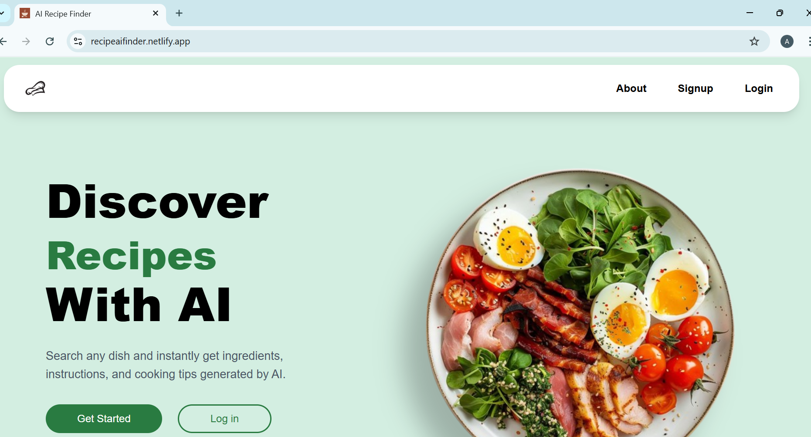
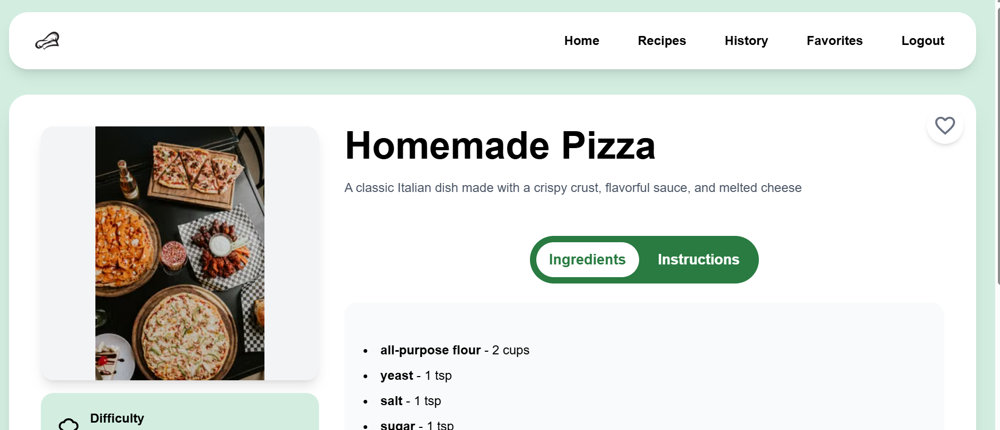
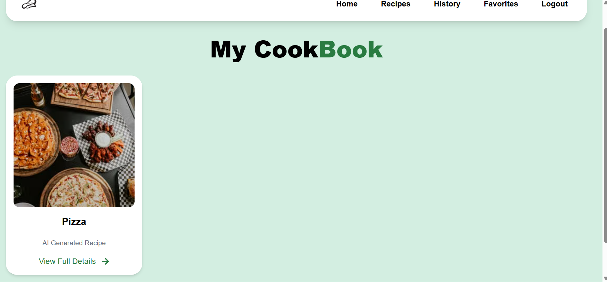
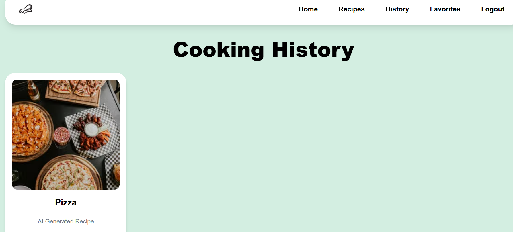

# 🍽️ AI Recipe Finder

An AI-powered full-stack web application that helps users discover recipes using AI. Users can securely create an account, generate detailed recipes, save favorites, track their cooking history, and enjoy a responsive experience across devices.

## 🌐 Live Demo

**Live Application:** https://recipeaifinder.netlify.app

---
## 📸 Screenshots

### 🏠 Home Page



### 🤖 AI Generated Recipe



### ❤️ Favorites



### 📜 Cooking History



# ✨ Features

### 🔐 Authentication

* User Registration & Login
* JWT Authentication
* Protected Routes
* Secure Logout

### 🤖 AI Recipe Generation

* Generate recipes using **Groq Llama AI**
* AI-generated recipes with ingredients 
* Step-by-step cooking instructions
* Recipes automatically saved to the database
* Tab-based recipe details (Ingredients & Instructions)

### ❤️ User Features

* Save favorite recipes
* Remove favorites
* Cooking history
* Paginated favorites and history
* Responsive design for desktop and mobile
* Loading states for better user experience

---

# 🛠️ Tech Stack

## Frontend

* React
* Vite
* Tailwind CSS
* React Router


## Backend

* FastAPI
* SQLAlchemy
* Pydantic
* JWT Authentication

## Database

* PostgreSQL (Production - Neon)
* SQLite (Local Development)

## AI

* Groq Llama API

## Deployment

* Frontend: Netlify
* Backend: Render
* Database: Neon PostgreSQL

---

# 📂 Project Structure

```text
AI Powered Recipe Finder App
│
├── backend
│   ├── models
│   ├── ai_service.py
│   ├── auth.py
│   ├── env.example
│   ├── database.py
│   ├── image_service.py
│   ├── main.py
│   ├── requirements.txt
│   ├── schemas.py
│   └── security.py
│
├── frontend
│   ├── src
│   │   ├── assets
│   │   ├── components
│   │   ├── App.jsx
│   │   ├── index.css
│   │   └── main.jsx
│   ├── public
│   └── package.json
│──.gitignore
└── README.md
```


# 🚀 Installation

## Clone the repository

```bash
git clone https://github.com/aparnavv373/Recipe-Finder
cd Recipe-Finder
```

## Backend Setup

```bash
cd backend

python -m venv venv

# Windows
venv\Scripts\activate

# macOS / Linux
source venv/bin/activate

pip install -r requirements.txt

uvicorn main:app --reload
```

## Frontend Setup

```bash
cd frontend

npm install

npm run dev
```

---

# 🔑 Environment Variables

Create a `.env` file inside the **backend** directory.

```env
SECRET_KEY=
DATABASE_URL=
GROQ_API_KEY=
PEXELS_API_KEY=
PEXELS_API_URL=
```

---

# 📌 API Overview

Some of the major API endpoints include:

| Method | Endpoint            | Description            |
| ------ | ------------------- | ---------------------- |
| POST   | `/signup`           | Register a new user    |
| POST   | `/login`            | User login             |
| GET    | `/details/{recipe_id}`   | Get recipe details         |
| POST   | `/generate-recipe` | Generate AI recipe     |
| GET    | `/favorites`        | Fetch favorite recipes |
| POST   | `/favorites/{recipe_id}`        | Save a favorite recipe |
| DELETE | `/favorites/{recipe_id}`   | Remove favorite        |
| GET    | `/history`          | Fetch cooking history  |

---

# 🚀 Deployment

| Service  | Platform        |
| -------- | --------------- |
| Frontend | Netlify         |
| Backend  | Render          |
| Database | Neon PostgreSQL |


---
## 🤖 How It Works

1. User searches for a recipe.
2. The frontend sends a request to the FastAPI backend.
3. The backend communicates with the Groq Llama API.
4. The AI generates a structured recipe.
5. The recipe is stored in the database and displayed to the user.

# 🔮 Future Enhancements

- Email Verification
- Forgot Password
- Password Reset
- Refresh Tokens
- Generate Recipes from Available Ingredients

# 📚 Key Learning Outcomes

This project helped me gain hands-on experience with:

* Building full-stack applications using React and FastAPI
* Designing REST APIs
* JWT Authentication & Protected Routes
* SQLAlchemy ORM
* PostgreSQL & Cloud Database Migration
* AI API Integration
* Responsive UI Development
* Deploying applications using Netlify, Render, and Neon
* Debugging production deployment issues


## ⭐ Highlights

- Full-stack application built from scratch
- AI-powered recipe generation using Groq Llama
- JWT Authentication
- PostgreSQL database integration
- Responsive React UI
- Deployed on Netlify, Render, and Neon